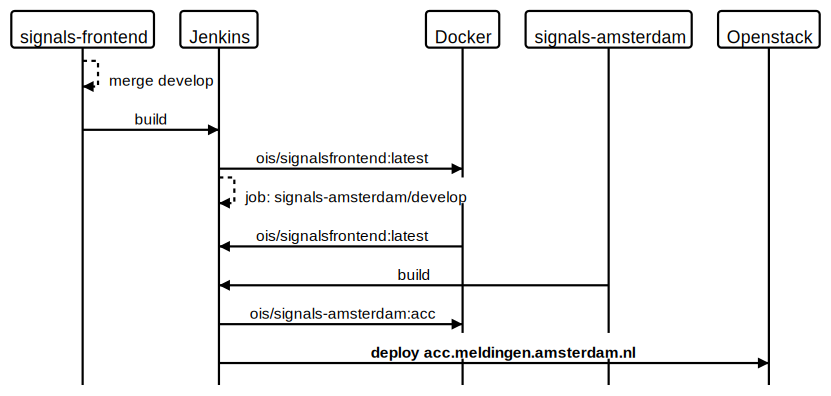

# Multi-tenant architecture

Date: 2020-06-03

## Status

Accepted

## Context

Following on the [Application configuration setup ADR](./0003-application-configuration-setup.md), the `signals-frontend` repository has to be split into separate parts; one where the code lives and another where the configuration for that code lives. The former will be the existing `signals-frontend` repository and the latter will be multiple repositories that contain their own configuration. Each separate configuration repository can deploy into a branded instance of `signals-frontend`.

At the time of writing, the configuration for [acc.meldingen.amsterdam.nl](https://acc.meldingen.amsterdam.nl) and [meldingen.amsterdam.nl](https://meldingen.amsterdam.nl) has been put in the [`signals-amsterdam`](https://github.com/Amsterdam/signals-amsterdam) repository. On deployment, either the acceptance or production configuration is mounted in the `ois/signalsfrontend:latest` Docker image so that each deployed container has its own environment specific settings. The `signals-frontend` repo contain default configuration that is used in development and for running unit tests.

Since the configuration is extracted from the base repository, it is now possible to deploy an infinite number of SIA instances. This also means that, where we would originally deploy `signals-frontend` to (acc.)meldingen.amsterdam.nl, we will now have to deploy `signals-amsterdam` instead. A merge to either the `develop` or the `master` in the `signals-frontend` repository, however, should still deploy to (acc.)meldingen.amsterdam.nl.

~~To accomplish that, the build server (Jenkins) should trigger related jobs on each merge, like so:~~

```Groovy
if (BRANCH == "develop") {
    stage("Deploy to ACC") {
        tryStep "deployment", {
            build job: '/SIA_Signalen_Amsterdam/signals-amsterdam/develop'
        }
    }
}

if (BRANCH == "master") {
    stage("Deploy to PROD") {
        tryStep "deployment", {
            build job: '/SIA_Signalen_Amsterdam/signals-amsterdam/master'
        }
    }
}
```

In turn, a merge to either `develop` or `master` in the `signals-amsterdam` repository should also deploy a new version to (acc.)meldingen.amsterdam.nl.

The flow for merging in the `signals-frontend` repository is the following (for the `develop` branch):

### Merge flow `signals-frontend`



### Merge flow `signals-amsterdam`


### API

All separate instances use the same API for storing and retrieving data. In the future this can differ where each instance has its own API, serving its own specific data.

For the foreseeable future, the plan is to set up a total of three repositories: `signals-amsterdam`, `signals-weesp` and `signals-amsterdamsebos`:


## Challenges

The biggest challenge is keeping repositories in sync. In order to be able to use configuration settings, the responsible configuration repositories have to contain the configuration before it can be used by `signals-frontend`.

~~Another challenge is the deploy preview that is currently handled by Netlify; each branch in `signals-frontend` can be published separately to show-case specific features or functionality. However, since the code and the configuration is split, a `signals-frontend` build will contain the default configuration and not the instance-specific configuration and thus Netlify doesn't seem suitable at this point in time.~~
