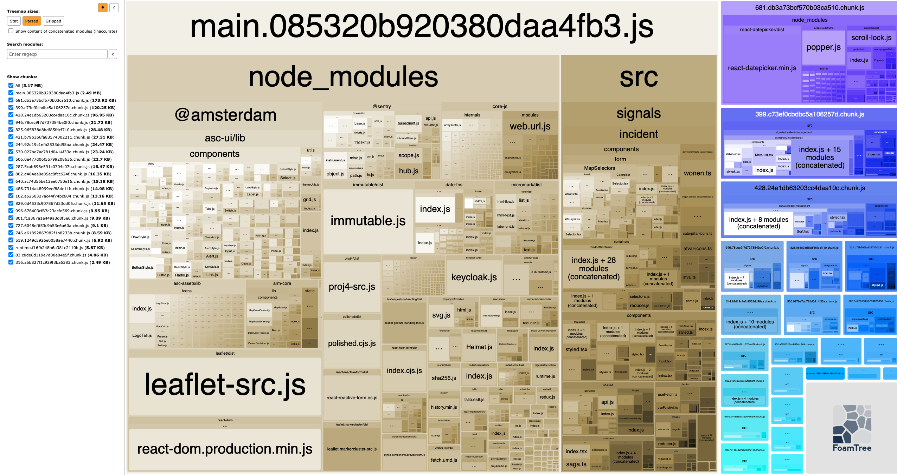
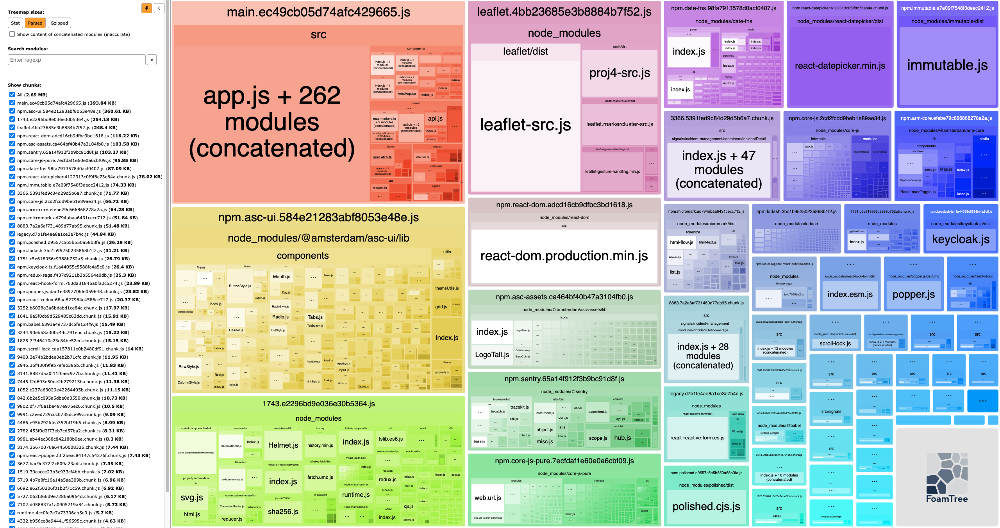

# Bundle splitting strategy

Date: 2021-11-19

## Status

Accepted

## Context

So far, no significant effort has been put into optimizing the way bundles and chunks are generated for the application, other than lazy loading major parts of the front and back-office modules by means of implementing [React code splitting](https://reactjs.org/docs/code-splitting.html).

Since the application has only one entry point, `app.js`, Webpack doesn't know how to split the code and its dependencies into usable chunks that are not too small and not too big. Too small would be less than a couple of kilobytes and too big would be a chunk of a couple of hundreds of kilobytes. It takes some tinkering to find the sweet spot.

Without custom settings in Webpack, one 'main' chunk is generated that contains most, if not all, code and dependencies from the entry point. At the time of writing this is a blob of close to 5 MB of code. If only a very small part of that blob changes, let's say a 20 Kb dependency or a 4 Kb component, the browser is forced to download the whole 5 MB instead of just the part that changed. Not a very big impact on a fast office or home connection, but detrimental to the experience on a mobile device with a 4G or 3G connection that has a narrow bandwidth and suffers from latency issues.

To improve loading times and rendering speed, the big main bundle needs to be split up into smaller logical parts. We not only help our website's visitors, we will also reduce the amount of data that has to be transferred over the network and this reducing the load on the web server.

## Goal

Split the code in such a way that the least amount of chunks has to be regenerated on each consecutive build.

## Approach

First, we need to see what the current situation is. Below is a screenshot from the overview that the bundle analyzer plugin generated. To the right of the screenshot we can see the chunks that come from the code splitting with React. On the left, we can also clearly see that the main chunk is really large and contains application code as well as dependencies. Even if the dependencies don't receive any updates, the whole main chunk will be updated, which will be the case for each release that we push to production.

### Aggressive splitting

We can split the code in such a way that each dependency has its own chunk. This way only the updated dependencies need to be downloaded after a new build/release. This will, however, generate such a large amount of chunks that it becomes inefficient; too many requests with too low a payload size.

### Fully customized splitting

Looking at which dependencies belong together (for instance `Leaflet` and `proj4`), which dependencies are likely to be updated often (or not, like `react-reactive-form`), we can come up with a configuration that is fully tailored to the project's list of dependencies. Efficient in terms of load times, but not in terms of maintenance; whenever a dependency is removed, renamed or gets a breaking update, chances are we need to revisit the Webpack configuration to reflect the change.

### Middle ground

A solution that covers both aforementioned scenarios would:

- compile a separate chunk for each dependency
- have a minimum size for generated chunks (combining chunks if they're too small)
- have a maximum size for generated chunks (splitting chunks if they're too big)
- combine dependencies that are unlikely to be updated often
- have as less custom configuration as possible

## Outcome

Applying all the middle ground requirements, the result is as follows:

### Comparison

__Chunk sizes__

Before: 3.17 MB

After: 2.69 MB

__Average load times (throttled, simulated network traffic)__

<table>
  <thead>
    <tr>
      <th rowspan="2"></th>
      <th colspan="2">WiFi</th>
      <th colspan="2">4G</th>
      <th colspan="2">Good 3G</th>
    </tr>
    <tr>
      <th>Before</th>
      <th>After</th>
      <th>Before</th>
      <th>After</th>
      <th>Before</th>
      <th>After</th>
    </tr>
  </thead>
  <tbody>
    <tr>
      <th>DOMContentLoaded (ms)</th>
      <td>180</td>
      <td>230</td>
      <td>4200</td>
      <td>3000</td>
      <td>13000</td>
      <td>6250</td>
    </tr>
    <tr>
      <th>load (s)</th>
      <td>950</td>
      <td>940</td>
      <td>6200</td>
      <td>5200</td>
      <td>15000</td>
      <td>13000</td>
    </tr>
    <tr>
      <th>completed (s)</th>
      <td>650</td>
      <td>712</td>
      <td>5500</td>
      <td>4800</td>
      <td>13500</td>
      <td>12000</td>
    </tr>
  </tbody>
</table>

## Conclusion

Load times for WiFi connection are more or less the same, but the most significant change is for the 4G and 3G connections. Totally worth the effort.
