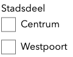
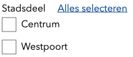
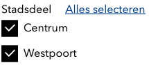

# CheckboxList

Component that renders a list of checkboxes with an optional toggle to check or uncheck all boxes in the group at once.

## Simple group

```jsx
<CheckboxList
  title="Stadsdeel"
  name="fooBarBaz"
  options={[
    { key: 'A', value: 'Centrum' },
    { key: 'B', value: 'Westpoort' },
  ]}
/>
```

will render:



HTML:

```html
<input
  data-id="A"
  id="fooBarBaz_A"
  name="fooBarBaz"
  type="checkbox"
  value="A"
/>
<input
  data-id="A"
  id="fooBarBaz_A"
  name="fooBarBaz"
  type="checkbox"
  value="B"
/>
```

## Group with toggle

Any group can be given the option to render a toggle that checks or unchecks all boxes at once.

When a toggle is rendered, the component's behaviour is as follows:

- clicking the toggle will check or uncheck all boxes
- the toggle label text will be the value of prop
  - `toggleAllLabel`: when NOT having toggled all boxes or NOT having checked all boxes manually
  - `toggleNothingLabel`: when having toggled all boxes or having checked all boxes manually

```jsx
<CheckboxList
  hasToggle
  name="fooBarBaz"
  options={[
    { key: 'A', value: 'Centrum' },
    { key: 'B', value: 'Westpoort' },
  ]}
  title="Stadsdeel"
/>
```

will render:



HTML:

```html
<!-- toggle -->
<label> Alles selecteren </label>

<!-- checkboxes -->
<input
  data-id="A"
  id="fooBarBaz_A"
  name="fooBarBaz"
  type="checkbox"
  value="A"
/>
<input
  data-id="A"
  id="fooBarBaz_A"
  name="fooBarBaz"
  type="checkbox"
  value="B"
/>
```

## Group with named toggle

When a group of checkboxes can be represented by a single value when all boxes are checked, the component can be given a name for the toggle element (which will render a checkbox with that name) which will show up in the submitted form data.

```jsx
<CheckboxList
  groupName="qux"
  groupValue="stadsdeel" // note that both `groupName` and `groupValue` are required for a named group to work
  hasToggle
  name="fooBarBaz"
  options={[
    { key: 'A', value: 'Centrum' },
    { key: 'B', value: 'Westpoort' },
  ]}
  title="Stadsdeel"
/>
```

will render:


HTML:

```html
<!-- toggle -->
<label>
  Alles selecteren
  <input name="qux" type="checkbox" value="stadsdeel" />
</label>

<!-- checkboxes -->
<input
  data-id="A"
  id="fooBarBaz_A"
  name="fooBarBaz"
  type="checkbox"
  value="A"
/>
<input
  data-id="A"
  id="fooBarBaz_A"
  name="fooBarBaz"
  type="checkbox"
  value="B"
/>
```

## Check all options in a group

Boxes can be shown checked when rendering the component by setting values in the `defaultValue` prop array. Each entry in that array should be equal to an entry in the `options` prop array.

There are two ways to have all boxes be checked when rendering the component:

### 1. Group without named toggle

```jsx
<CheckboxList
  defaultValue={[
    { key: 'A', value: 'Centrum' }
    { key: 'B', value: 'Westpoort' },
  ]}
  hasToggle
  name="fooBarBaz"
  options={[
    { key: 'A', value: 'Centrum' },
    { key: 'B', value: 'Westpoort' },
  ]}
  title="Stadsdeel"
/>
```

will render:



HTML:

```html
<!-- toggle -->
<label> Alles selecteren </label>

<!-- checkboxes -->
<input
  data-id="A"
  id="fooBarBaz_A"
  name="fooBarBaz"
  type="checkbox"
  value="A"
/>
<input
  data-id="A"
  id="fooBarBaz_A"
  name="fooBarBaz"
  type="checkbox"
  value="B"
/>
```

### 2. Group with named toggle

Whenever a group has a named toggle, providing `groupName`, `groupId` and `groupValue` will make it possible to have a toggle that will show up in the form data. Note that both the toggle input value as well as all the other input values will be in the form data and need to be filtered manually, if desired.

```jsx
<CheckboxList
  defaultValue={[
    {
      key: 'https://acc.api.data.amsterdam.nl/signals/v1/public/terms/categories/afval',
      value: 'Afval',
    },
  ]}
  groupName="maincategory_slug"
  groupId="https://acc.api.data.amsterdam.nl/signals/v1/public/terms/categories/afval"
  groupValue="afval"
  hasToggle
  name="category_slug"
  options={[
    {
      id: 'https://acc.api.data.amsterdam.nl/signals/v1/public/terms/categories/afval/sub_categories/asbest-accu',
      value: 'Asbest / accu',
      slug: 'asbest-accu',
    },
    {
      id: 'https://acc.api.data.amsterdam.nl/signals/v1/public/terms/categories/afval/sub_categories/container-is-kapot',
      value: 'Container is kapot',
      slug: 'container-is-kapot',
    },
    {
      id: 'https://acc.api.data.amsterdam.nl/signals/v1/public/terms/categories/afval/sub_categories/container-is-vol',
      value: 'Container is vol',
      slug: 'container-is-vol',
    },
  ]}
  title="Afval"
/>
```

HTML:

```html
<!-- toggle -->
<label tabindex="0">
  Niets selecteren
  <input name="maincategory_slug" type="checkbox" value="afval" />
</label>

<!-- checkboxes -->
<input name="category_slug" type="checkbox" value="asbest-accu" checked="" />
<input
  name="category_slug"
  type="checkbox"
  value="container-is-kapot"
  checked=""
/>
<input
  name="category_slug"
  type="checkbox"
  value="container-is-vol"
  checked=""
/>
```
